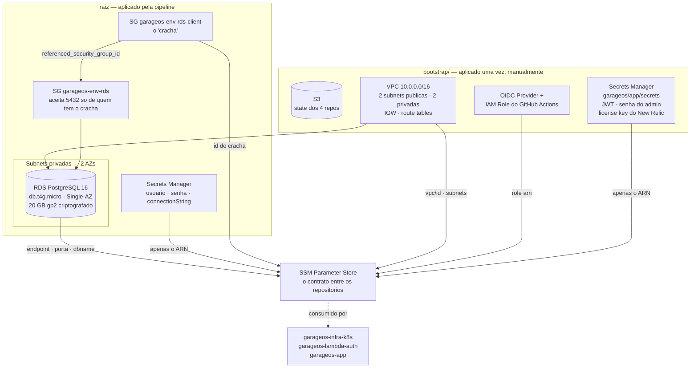

# garageos-infra-database

Infraestrutura de dados do **GarageOS**: o banco gerenciado (Amazon RDS PostgreSQL) e, na pasta [`bootstrap/`](bootstrap/README.md), a fundação da conta AWS — state remoto do Terraform, autenticação OIDC do GitHub Actions, VPC e segredos compartilhados da aplicação.

> Um dos quatro repositórios do Tech Challenge — Fase 3. É o **primeiro** a ser aplicado.

---

## O que este repositório provisiona



| Camada | Arquivos | Recursos |
|---|---|---|
| **Bootstrap** | `bootstrap/s3-state.tf`, `oidc.tf`, `vpc.tf`, `app-secrets.tf`, `ssm.tf` | Bucket de state, OIDC + IAM Role, rede, segredo compartilhado da aplicação (JWT, senha de admin e license key do New Relic) |
| **Banco** | `rds.tf`, `security-groups.tf`, `secrets.tf`, `ssm.tf` | Instância RDS, DB Subnet Group, dois Security Groups, senha no Secrets Manager, parâmetros no SSM |

Justificativa da escolha do banco e da configuração: [RFC 0002](https://github.com/TechChallengeFase1/garageos-app/blob/main/docs/rfcs/0002-escolha-banco-de-dados.md).

---

## Decisões que valem conhecer antes de mexer

**Dois Security Groups, não uma faixa de IP.** O requisito é "somente as origens necessárias acessam o PostgreSQL", e a origem principal são os nós do EKS — que ainda não existem quando este repositório é aplicado. A solução é um SG vazio, o **crachá** (`garageos-<env>-rds-client`), e o SG do banco aceitando a porta 5432 apenas de quem o carrega. O ID do crachá vai para o SSM; o `infra-k8s` o anexa aos nós e o `lambda-auth` a si mesma. Regra por CIDR não serviria: os nós escalam pelo HPA e trocam de IP.

**A senha nunca é escrita por uma pessoa.** O Terraform sorteia com `random_password` e grava no Secrets Manager, com a `connectionString` já pronta para o Npgsql. Ninguém precisa conhecê-la para o sistema funcionar.

> **A senha em texto puro fica no state.** Não há recurso no Terraform que evite isso. A defesa é proteger o state: bucket privado, versionado e criptografado, e `*.tfstate` no `.gitignore`. Nunca copie o state para fora.

**O que vai para o SSM não é segredo.** Endpoint, porta, nome do banco e ID do crachá são identificadores. A senha fica no Secrets Manager; o SSM guarda apenas o **ARN de onde buscá-la**.

**Um segredo do bootstrap não é sorteado.** `jwtSecretKey` e `adminPassword` saem do `random_password`, mas a **license key do New Relic** é emitida pela New Relic e identifica a conta de destino — ela entra como variável no apply do bootstrap e nunca é versionada:

```bash
terraform apply -var="newrelic_license_key=..."
```

Guardá-la no mesmo segredo dos demais dá um único lugar de onde tudo é lido: a pipeline do `garageos-app` a coloca no Secret do Kubernetes, e o `garageos-infra-k8s` a passa ao Helm do `nri-bundle`. Deixar vazio desabilita o envio — o agente sobe, não encontra a chave e se desliga, sem derrubar a aplicação.

**Single-AZ, sem Performance Insights, `skip_final_snapshot = true`.** Escolhas de ambiente descartável com orçamento de créditos, registradas conscientemente. Produção real inverteria as três.

---

## Como executar

### Pré-requisitos

- AWS CLI autenticada (`aws sts get-caller-identity` deve responder).
- Terraform >= 1.5.
- O `bootstrap/` já aplicado — veja [bootstrap/README.md](bootstrap/README.md).

### Deploy automático (caminho normal)

`.github/workflows/terraform.yml` cuida do ciclo, autenticando por **OIDC**, sem nenhuma credencial estática da AWS neste repositório:

| Gatilho | Ação |
|---|---|
| Pull Request para `homolog` ou `main` | `fmt` + `validate` + `plan`. Nunca aplica |
| Push em `homolog` | `apply` no workspace `homolog` |
| Push em `main` | `apply` no workspace `producao` |
| `workflow_dispatch` | `plan`, `apply` ou `destroy` no ambiente escolhido |

O apply só dispara quando muda infraestrutura de verdade — há filtro de caminho para que corrigir uma linha deste README não recrie o banco.

### Execução local

```bash
terraform init
```

```bash
terraform workspace select -or-create producao
```

```bash
terraform plan -var-file=producao.tfvars
```

```bash
terraform apply -var-file=producao.tfvars
```

Para homologação, troque o workspace e o `-var-file` por `homolog`.

### Destruir ao fim da janela de trabalho

```bash
terraform destroy -var-file=producao.tfvars
```

> **Custo:** `db.t4g.micro` é elegível ao free tier, mas ele cobre **750 h/mês de uma instância**. Com `homolog` e `producao` ligados ao mesmo tempo o total passa de 1400 h e o excedente é cobrado (~US$ 12/mês). Destrua o ambiente que não estiver em uso.

---

## Conferindo o resultado

```bash
terraform output
```

| Output | O que traz |
|---|---|
| `ambiente` | Ambiente derivado do workspace |
| `rds_endpoint` | Hostname do banco — alcançável apenas de dentro da VPC |
| `rds_port` | Porta do PostgreSQL |
| `rds_client_security_group_id` | O crachá, a ser anexado por quem precisa do banco |
| `secret_arn` | ARN do segredo com as credenciais |
| `como_ler_a_senha` | Comando pronto para recuperar a connection string |

Parâmetros publicados para os outros repositórios:

```bash
aws ssm get-parameters-by-path --path /garageos --recursive --query "Parameters[].Name" --output table
```

### Acessar o banco de um SGBD local

O RDS tem `publicly_accessible = false` e não há rota da internet até ele. Use o túnel disponível no repositório da aplicação:

```bash
./scripts/tunel-banco.sh
```

Ele sobe um pod no cluster que herda o crachá dos nós e encaminha `localhost:5432` até o RDS.

---

## Estrutura

```text
garageos-infra-database/
├── bootstrap/                # Fundação — aplicada uma vez, manualmente
│   ├── s3-state.tf           # Bucket do state remoto dos 4 repositórios
│   ├── oidc.tf               # OIDC Provider + IAM Role do GitHub Actions
│   ├── vpc.tf                # VPC, subnets, IGW, route tables
│   ├── app-secrets.tf        # JWT, senha do admin e license key do New Relic
│   └── ssm.tf                # Publicação dos IDs criados
├── rds.tf                    # Instância e DB Subnet Group
├── security-groups.tf        # O crachá e o SG do banco
├── secrets.tf                # random_password + Secrets Manager
├── ssm.tf                    # O que este repositório publica
├── data.tf                   # O que ele lê do bootstrap
├── homolog.tfvars            # Ambiente de homologação
├── producao.tfvars           # Ambiente de produção
└── .github/workflows/        # terraform.yml (OIDC, plan/apply/destroy)
```

---

## Documentação relacionada

- [Índice da documentação de arquitetura](https://github.com/TechChallengeFase1/garageos-app/blob/main/docs/README.md)
- [RFC 0002 — Escolha do banco de dados](https://github.com/TechChallengeFase1/garageos-app/blob/main/docs/rfcs/0002-escolha-banco-de-dados.md)
- [ADR 0001 — Comunicação entre os repositórios](https://github.com/TechChallengeFase1/garageos-app/blob/main/docs/adrs/0001-comunicacao-entre-repositorios.md)
- [Diagrama ER](https://github.com/TechChallengeFase1/garageos-app/blob/main/docs/diagramas/modelo-er.md)
- **Swagger da API**: `http://<hostname-do-nlb>/swagger` — veja o [README do `garageos-app`](https://github.com/TechChallengeFase1/garageos-app#documentação-da-api-swagger)

## Repositórios da solução

| Repositório | Responsabilidade |
|---|---|
| [`garageos-app`](https://github.com/TechChallengeFase1/garageos-app) | API .NET, manifestos Kubernetes e documentação central |
| **`garageos-infra-database`** *(este)* | RDS PostgreSQL e bootstrap da conta |
| [`garageos-infra-k8s`](https://github.com/TechChallengeFase1/garageos-infra-k8s) | Cluster EKS |
| [`garageos-lambda-auth`](https://github.com/TechChallengeFase1/garageos-lambda-auth) | Lambda de autenticação e API Gateway |
